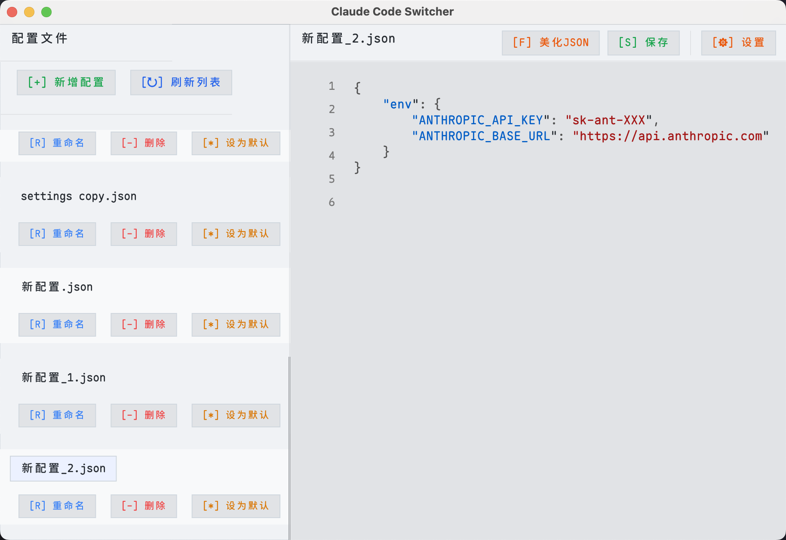

# Claude Code Switcher

<div align="center">


**一个现代化的 Claude AI 配置管理工具**

[](https://www.rust-lang.org)
[](https://github.com/jiji262/Claude-Code-Switcher)
[](LICENSE)

</div>

---

## 📖 简介

Claude Code Switcher 是一个专为 Claude AI 开发者设计的配置管理工具。它提供了直观的图形界面，让你能够轻松管理多个 Claude AI 配置环境，实现一键切换，提高开发效率。



## ✨ 主要功能

### 🔄 智能配置切换
- **一键切换**：快速在不同 Claude AI 配置间切换
- **自动同步**：自动同步到 Claude 的活动配置文件 (`~/.claude/settings.json`)
- **默认配置**：设置和管理默认配置文件

### 📁 完整配置管理
- **CRUD 操作**：创建、编辑、重命名、删除配置文件
- **实时保存**：自动保存编辑内容，防止数据丢失
- **备份恢复**：安全的配置文件管理机制

### 🎨 现代化界面
- **双主题支持**：深色/浅色主题自由切换
- **语法高亮**：内置 JSON 编辑器，支持语法高亮
- **响应式设计**：适配不同屏幕尺寸
- **实时反馈**：操作状态和进度提示

### ⚙️ 个性化设置
- **自定义目录**：可配置配置文件存储位置
- **持久化设置**：应用设置自动保存
- **跨平台兼容**：支持 macOS、Windows、Linux

## 🚀 快速开始

### 📦 下载安装

#### macOS (推荐)
1. 下载 `Claude Code Switcher.app`
2. 拖拽到 `/Applications` 文件夹
3. 首次运行可能需要在"系统偏好设置 > 安全性与隐私"中允许

#### 其他平台
1. 下载对应平台的可执行文件
2. 直接运行或添加到系统 PATH

### 🔧 从源码构建

#### 环境要求
- **Rust**: 1.70+ ([安装指南](https://rustup.rs/))
- **系统**: macOS 10.15+ / Windows 10+ / Linux

#### 构建步骤
```bash
# 1. 克隆仓库
git clone https://github.com/jiji262/Claude-Code-Switcher.git
cd Claude-Code-Switcher

# 2. 构建应用
cargo build --release

# 3. 运行应用
cargo run --release
```

#### 平台特定构建

<details>
<summary><strong>🍎 macOS (Apple Silicon)</strong></summary>

```bash
# 使用构建脚本 (推荐)
./build-macos.sh

# 手动构建
rustup target add aarch64-apple-darwin
cargo build --release --target aarch64-apple-darwin
```

生成文件：
- `dist/claude-code-switcher-macos` - 独立可执行文件
- `dist/Claude Code Switcher.app` - macOS 应用包

</details>

<details>
<summary><strong>🪟 Windows</strong></summary>

```bash
# 使用构建脚本
./build.bat

# 手动构建
cargo build --release
```

</details>

<details>
<summary><strong>🐧 Linux</strong></summary>

```bash
# 使用构建脚本
./build.sh

# 手动构建
cargo build --release
```

</details>

## 📚 使用指南

### 🎯 基本操作

#### 配置文件管理
```
📁 默认配置目录: ~/.claude-code-switcher/settings/
📄 Claude 配置文件: ~/.claude/settings.json
🔄 自动同步: 选中配置自动同步到 Claude
```

#### 界面布局
- **左侧面板**: 配置文件列表和操作按钮
- **右侧面板**: JSON 编辑器和工具栏
- **状态栏**: 实时状态和字符计数

### ⌨️ 操作指南

| 操作 | 按钮 | 功能描述 |
|------|------|----------|
| 新建配置 | `[+] 新增` | 创建新的配置文件 |
| 重命名 | `[R] 重命名` | 重命名选中的配置文件 |
| 删除配置 | `[-] 删除` | 删除选中的配置文件 |
| 设为默认 | `[*] 设为默认` | 将配置设为默认并同步到 Claude |
| 保存文件 | `[S] 保存` | 保存当前编辑内容 |
| 格式化 | `[F] 美化JSON` | 格式化 JSON 内容 |
| 重新加载 | `[R] 重新加载` | 重新加载文件内容 |
| 应用设置 | `[⚙] 设置` | 打开应用设置面板 |

### 🔧 配置示例

```json
{
  "env": {
    "ANTHROPIC_API_KEY": "sk-ant-your-api-key-here",
    "ANTHROPIC_BASE_URL": "https://api.anthropic.com"
  }
}
```

## 🛠️ 技术架构

### 核心技术栈
- **[Rust](https://www.rust-lang.org/)** - 系统级性能与内存安全
- **[egui](https://github.com/emilk/egui)** - 即时模式 GUI 框架
- **[serde](https://serde.rs/)** - 高性能序列化框架
- **[tokio](https://tokio.rs/)** - 异步运行时
- **[rfd](https://github.com/PolyMeilex/rfd)** - 原生文件对话框

### 架构特点
- **零依赖运行时**: 单文件可执行，无需额外安装
- **跨平台兼容**: 统一代码库支持多平台
- **高性能渲染**: GPU 加速的现代 UI
- **内存安全**: Rust 语言级别的安全保证

## 💻 系统要求

| 平台 | 最低版本 | 推荐配置 |
|------|----------|----------|
| **macOS** | 10.15 (Catalina) | Apple Silicon (M1/M2/M3) |
| **Windows** | Windows 10 | Windows 11 |
| **Linux** | Ubuntu 18.04+ | 现代发行版 |
| **内存** | 2GB | 4GB+ |
| **存储** | 50MB | 100MB+ |

## 🔧 故障排除

<details>
<summary><strong>🍎 macOS 权限问题</strong></summary>

如果遇到"无法打开，因为无法验证开发者"的错误：

**方法一：系统设置**
1. 打开"系统偏好设置" > "安全性与隐私" > "通用"
2. 点击"仍要打开"或"允许从以下位置下载的应用"

**方法二：命令行**
```bash
# 移除隔离属性
xattr -d com.apple.quarantine "Claude Code Switcher.app"
# 或针对可执行文件
xattr -d com.apple.quarantine ./claude-code-switcher-macos
```

</details>

<details>
<summary><strong>📁 配置文件问题</strong></summary>

**默认路径**:
- 应用配置: `~/.claude-code-switcher/`
- Claude 配置: `~/.claude/settings.json`

**自定义路径**:
如果 Claude 使用不同路径，可在应用设置中修改配置目录。

</details>

<details>
<summary><strong>🐛 常见问题</strong></summary>

**Q: 应用无法启动**
A: 检查系统版本是否满足最低要求，确保有足够的内存空间。

**Q: 配置切换不生效**
A: 确认 Claude 配置文件路径正确，检查文件权限。

**Q: JSON 格式错误**
A: 使用内置的"美化JSON"功能检查语法，或参考配置示例。

</details>

## 🤝 贡献指南

我们欢迎社区贡献！请查看 [贡献指南](CONTRIBUTING.md) 了解详情。

### 开发环境设置
```bash
# 1. Fork 并克隆仓库
git clone https://github.com/your-username/Claude-Code-Switcher.git

# 2. 安装依赖
cargo check

# 3. 运行开发版本
cargo run

# 4. 运行测试
cargo test
```

## 📄 许可证

本项目采用双许可证：

- **应用程序**: [MIT](LICENSE-MIT) OR [Apache-2.0](LICENSE-APACHE)
- **字体文件**: [SIL Open Font License 1.1](src/font.ttf)

## 🙏 致谢

- [egui](https://github.com/emilk/egui) - 优秀的即时模式 GUI 框架
- [Rust 社区](https://www.rust-lang.org/community) - 提供强大的生态系统
- 所有贡献者和用户的支持

---

<div align="center">

**Claude Code Switcher** - 让 Claude AI 配置管理变得简单高效 🚀

[⭐ Star](https://github.com/jiji262/Claude-Code-Switcher) | [🐛 Report Bug](https://github.com/jiji262/Claude-Code-Switcher/issues) | [💡 Request Feature](https://github.com/jiji262/Claude-Code-Switcher/issues)

</div>
